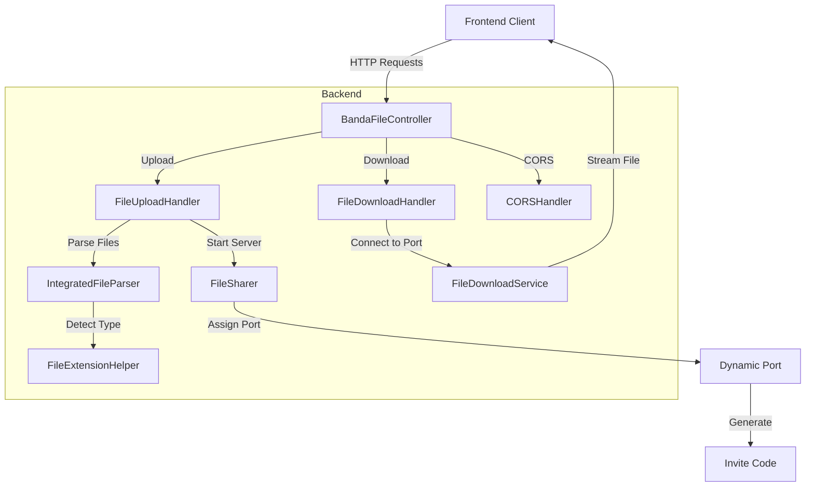
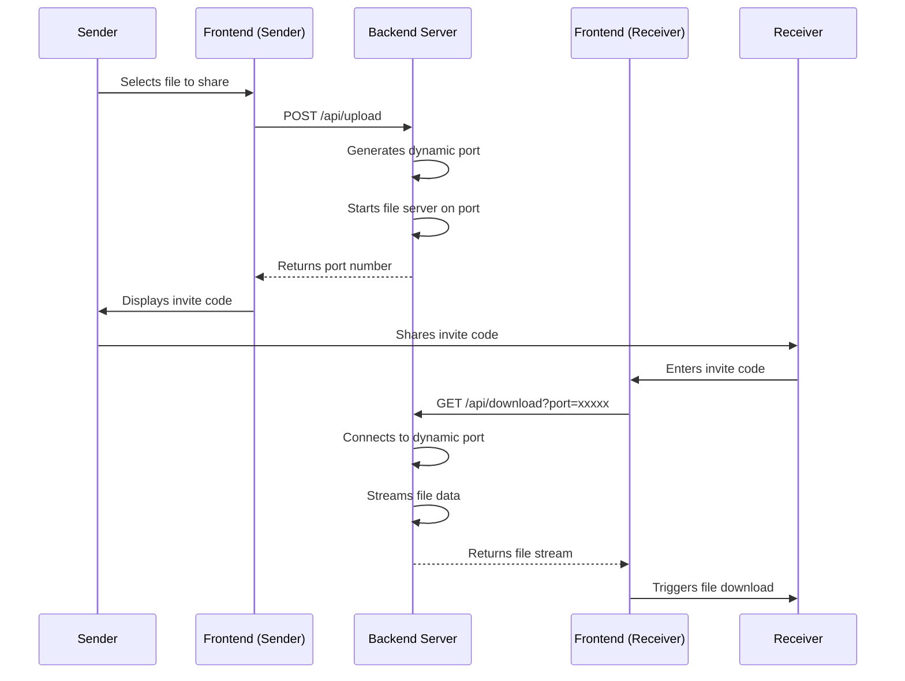

 Banda - P2P File Sharing Application

[](https://openjdk.java.net/)
[](https://nextjs.org/)
[](https://tailwindcss.com/)

Banda is a peer-to-peer file sharing application that allows users to share files securely with others via unique invite codes.

## Features

- Simple, modern UI with drag-and-drop file upload
- Peer-to-peer file sharing with dynamic port assignment
- Automatic file type detection
- No user accounts or registration required
- Docker support for easy deployment

## Architecture Overview

Banda follows a client-server architecture with a unique P2P approach for actual file transfers:



### Backend Components

1. **BandaFileController**
   - Initializes the HTTP server and routes
   - Manages the upload directory and thread pool

2. **HTTP Handlers**
   - `FileUploadHandler`: Processes file uploads, generates ports
   - `FileDownloadHandler`: Handles download requests
   - `CORSHandler`: Manages cross-origin requests

3. **Core Services**
   - `Filesharer`: Manages file sharing via dynamic ports
   - `FileDownloadService`: Handles downloading files from ports

4. **Utilities**
   - `IntegratedFileParser`: Parses multipart form data efficiently
   - `FileExtensionHelper`: Detects file types using Apache Tika

### Frontend Components

1. **Pages**
   - page.tsx: Main application with upload/download tabs

2. **Components**
   - `FileUpload`: Drag-and-drop upload functionality
   - `FileDownload`: Interface for receiving files
   - `InviteCode`: Displays shareable invite codes

### Data Flow



1. **Upload Process:**
   - User uploads file in frontend
   - Backend receives file and assigns port
   - Backend starts dedicated server on that port
   - Frontend displays invite code (port number)

2. **Download Process:**
   - User enters invite code in frontend
   - Backend connects to the corresponding port
   - File is streamed through backend to frontend
   - Browser triggers file download

## Getting Started

### Prerequisites

- Java 21 or later
- Node.js 18 or later
- Docker and Docker Compose (optional)

### Running with Docker

The easiest way to run Banda is with Docker:

```bash
# Clone the repository
git clone https://github.com/yourusername/banda.git
cd banda

# Start the application
docker-compose up -d

# Access the application at http://localhost:3000
```

### Running Manually

#### Backend Setup

```bash
# Navigate to project directory
cd banda

# Build the project
mvn clean package

# Run the backend server
java -jar target/banda-1.0-SNAPSHOT.jar
```

#### Frontend Setup

```bash
# Navigate to UI directory
cd banda/ui

# Install dependencies
npm install

# Edit the Next.js configuration for local development
# Open next.config.js and change:
# - http://backend:8080 to http://localhost:8080

# Start the development server
npm run dev
```

> **Note**: When running manually, you need to modify the next.config.js file to point to `localhost:8080` instead of `backend:8080` for API calls.

## Usage

1. **Sharing a File:**
   - Go to the "Share a File" tab
   - Drag and drop a file or click to select one
   - Once uploaded, you'll receive an invite code (port number)
   - Share this invite code with anyone you want to share the file with

2. **Receiving a File:**
   - Go to the "Receive a File" tab
   - Enter the invite code you received
   - Click "Download File"
   - The file will be downloaded to your device

## Technical Details

### Backend (Java)

- Built with native Java HTTP Server (no Spring)
- Uses dynamic port assignment for P2P file transfer
- Efficient multipart file parsing with state machine approach
- Apache Tika for file type detection

### Frontend (Next.js)

- Built with Next.js 14 and React 18
- TailwindCSS for styling
- React Dropzone for drag-and-drop functionality
- Axios for API requests

## Project Structure

```
banda/
├── src/                     # Java backend code
│   ├── main/
│   │   ├── java/com/banda/  # Java source files
│   │   └── resources/       # Configuration files
│   └── test/                # Test files
├── ui/                      # Next.js frontend
│   ├── src/                 # Frontend source code
│   │   ├── app/             # Next.js app router
│   │   └── components/      # React components
│   └── public/              # Static assets
├── docker-compose.yml       # Docker Compose configuration
├── Dockerfile.be            # Backend Dockerfile
├── Dockerfile.fe            # Frontend Dockerfile
└── pom.xml                  # Maven configuration
```

## Building for Production

```bash
# Backend
mvn clean package

# Frontend
cd ui
npm run build
```

## License

This project is licensed under the MIT License - see the LICENSE file for details.

## Acknowledgments

- Apache Tika for file type detection
- SLF4J and Logback for logging
- React Icons for UI icons
- TailwindCSS for styling
- Lovepreet for project inspo
